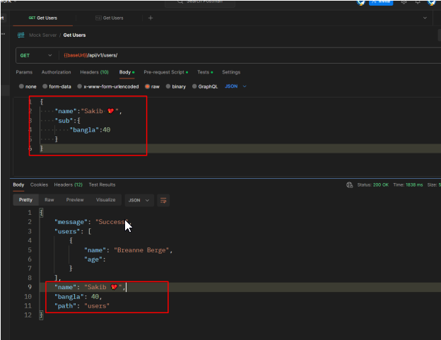
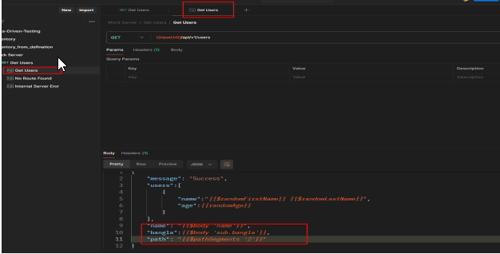
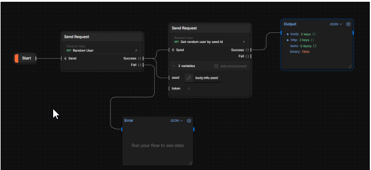
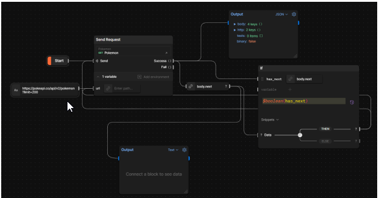
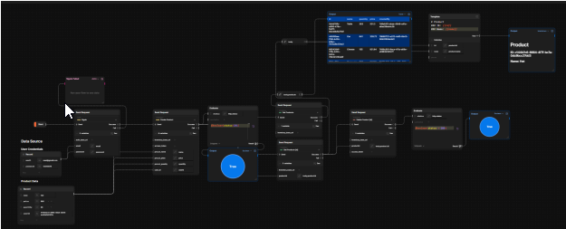

# Day - 03: Streamlining API Development with Mock Servers, Newman, and Data Flows

## Mock Server

A mock server is a simulated server that mimics the behavior of a real server or API. It generates pre-defined responses to HTTP requests based on predefined scenarios or rules, without actually executing any backend logic. Mock servers are commonly used during the development and testing phases of software projects.

You can use a Postman Collection to set up a mock server. When you send a request to the mock server, Postman returns a real-world response using data from your collection. By adding a mock server to your collection and adding examples to your requests, you can simulate the behavior of a real API. Before you set up a new mock server, create a collection with the API requests you want to mock, then add saved examples to each request. The examples have the data you want the mock server to return in response to each request. When you send a request to a mock server, Postman matches the request to a saved example in your collection. Postman then responds with the data you added to the example.

### Steps to create a sample Mock Server from the Collection

1. In Postman, send a request to any API. Your request must be saved to a collection.
2. In the response pane, select Save as Example. Postman automatically populates the example with the response you received when you sent the request.
3. Select Collections in the sidebar. Select the More Actions icon next to the collection where the request was saved and select Mock collection.
4. Give your mock a name and leave the other settings at their defaults. Select Create Mock Server.
5. Copy the mock URL and go back into your request. Replace the base part of the URL with the mock server URL (everything before the path, for example up to /customers).
6. Select Send. Postman returns the example response you saved for the request, this time from the mock server.
7. Open the example and change the response, then save the example and send the request again. Postman returns your edited mock response.

When creating a mock server, it's often necessary to understand the request body, headers, and other details. With the assistance of template helpers, you can effectively parse data from the request to ensure accurate and contextually appropriate responses.

## Contextual response example using Template helper

With template support, Postman mock servers can generate responses that vary based on the incoming request. Template helpers give you access to data from the incoming request, such as the body, query parameters, path segments, and headers. You can include that data in the response sent by the mock server.

<table>
  <thead>
    <tr>
      <th>Template helper</th>
      <th>Data returned</th>
    </tr>
  </thead>
  <tbody>
    <tr>
      <td>1. {{$body}}</td>
      <td>Return the full request body</td>
    </tr>
    <tr>
      <td>2. {{$body "path.to.property"}}</td>
      <td>Return the value of a specific property from the request body</td>
    </tr>
    <tr>
      <td>3. {{$headers "header-key"}}</td>
      <td>Return the value of a specific request header</td>
    </tr>
    <tr>
      <td>4. {{$queryParams "parameter-key"}}</td>
      <td>Return the value of a specific query parameter</td>
    </tr>
    <tr>
      <td>5. {{$pathSegments "1"}}</td>
      <td>Return the second segment of the request path (for example, if the request path is '/product/12345/details' then return 12345)</td>
    </tr>
    <tr>
      <td>6. {{$body "property" "default value"}}</td>
      <td>Define a default value for a property</td>
    </tr>
    <tr>
      <td>7. {{$body "a\.a"}}</td>
      <td>Return the value of the property 'a.a' which has a dot (.) in the key name</td>
    </tr>
  </tbody>
</table>

`


## Automation

Utilizing Postman CLI or Newman, you can seamlessly execute your Postman collection either from your terminal or within your CI pipeline. In this scenario, we leverage Newman as our command-line tool and GitHub Actions as our CI. Below, you'll find an example of how we create a GitHub Action, utilizing Newman alongside htmlextra for generating a comprehensive report for your collection.

### Newman cli

Newman is a command-line collection runner for Postman. It allows you to effortlessly run and test a Postman collection directly from the command line. It is built with extensibility in mind so that you can easily integrate it with your continuous integration servers and build systems.

### GitHub Action file

```yaml
name: Automated API tests using Postman CLI

on:
  push:
    branches:
      - main

jobs:
  automated-api-tests:
    runs-on: ubuntu-latest
    steps:
      - uses: actions/checkout@v3

      - name: Use Node.js 20.x
        uses: actions/setup-node@v3
        with:
          node-version: "20.x"

      - name: Install Newman
        run: npm install -g newman newman-reporter-htmlextra

      - name: Run API Collection
        run: newman run "${{secrets.collection_url}}" --env-var="baseUrl=${{secrets.baseUrl}}"

      - name: Generate HTML Report
        run: newman run "${{secrets.collection_url}}" --env-var="baseUrl=${{secrets.baseUrl}}" -r htmlextra --reporter-htmlextra-export "newman/report.html"
      - name: see
        run: ls

      - name: Upload Report
        uses: actions/upload-artifact@v3
        with:
          name: newman-report
          path: newman/report.html
```

Once this action is executed, you can perform tests on your collection. If any tests fail within your collection, the action will also fail. Upon successful testing, you'll discover a downloadable zip file containing the report of your collection.

## Postman Flows

Now, let's explore Postman Flows. Occasionally, we desire visual tools where we can interact with our API requests and responses, creating a business environment within the API data. Postman Flow provides precisely this opportunity.

Postman Flows is a visual editor that lets you directly manipulate APIs and observe the data flowing between them. You can use Flows to chain requests, handle data, and create real-world workflows in your Postman workspace. Flows are the ultimate way to take data from an API-enabled product, manipulate it to meet your needs, and see the results. Or you could take data from one API enabled product, make decisions, or process the data, then send it to another API-enabled product. This means you can build real-time integrations between two API-enabled products. To create a Flow, navigate to "Flows" from the left sidebar of Postman.

**Postman Flows has different types of blocks:**

`(1) Task (2) Logic
(3) Looping (4) Output
`

**However, within these categories, there are additional flows to explore:**

- **Start:** The first block that runs when a Flow is run.
- **Get Variable:** Gets the specified variable's value from anywhere in the Flow.
- **Create Variable:** Assigns a value to a variable that can then be accessed with the Get
  Variable block anywhere in the Flow. The input is any value (such as text, a number, or
  information from another block).
- **Record:** Structured information that can hold any of the other value block types or
  another record. Information is organized by having a key (the name assigned to the
  information) and a value.
- **List:** Outputs the specified list of values. Each item can be any type of block, for
  example, a data block, a string, or a record. Using a Select block in a row of the list
  enables information from another block to be passed into the list.
- **Date & Time:** Outputs the specified date and time.
- **Date:** Outputs the specified date.
- **Now:** Outputs the current date and time.
- **Select:** Select a specific part of the information output from another block. If the input
  information is from a Send Request block with a saved example, a drop-down will pop
  up that has all the information available to choose from, and selecting that information
  will auto-fill the select block.
- **Regex:** Outputs a regular expression.
- **Number**: A whole or decimal number that can be positive or negative.
- **Bool:** True or false.
- **String:** Outputs the text that you enter.
- **If:** Takes any number of variables and information, and takes a different branch
  depending on the result of the FQL condition. It sends the information to either the True
  or False pathway depending on the value of the FQL condition.
- **Evaluate:** Executes FQL to change information and work with variables. It outputs the
  result of the query.
- **Repeat:** Runs all of the blocks that come after it the specified number of times until a
  Collect block is encountered in which case it will stop repeating all blocks that come
  after the Collect block.
- **For:** Runs all of the blocks that come after it once for each item in the input list until a
  Collect block is encountered in which case it will stop repeating all blocks that come
  after the Collect block. A list of values like [1,2,3] or ["one", "two", "three"]
- **Collect:** For and Repeat blocks will stop repeating once this block is reached. Every
  item will be put into a new list and then output. Takes in a single item from a for or
  repeat sequence. Creates a list of all items sent to this block in the for or repeat
  sequence. Sends an event when the block is complete (when the for or repeat
  sequence has been run for every item and they're all in a new list).
- **Delay:** Waits the specified amount of time before allowing information through.
  Send Request: Runs a request in a collection and outputs the result. If a request that
  has a saved example was used, the result can be used as test data to run the Flow and
  auto-fill Select blocks.
- **Log (Console):** Sends the information input to the block to the Postman Console.
- **Output:** Displays the information input. The dropdown menu enables you to select from
  JSON, charts, tables, videos, images, and more. For more information and examples on
  the output block

**Below, I have provided some examples of Postman Flows for different APIs**

Random User API: [https://randomuser.me/api](https://randomuser.me/api)



**Handle Pagination Using Flows**
Pokémon APIs : [https://pokeapi.co/api/v2/pokemon?limit=200](https://pokeapi.co/api/v2/pokemon?limit=200)



**Inventory Flow with Auth APIs:**

